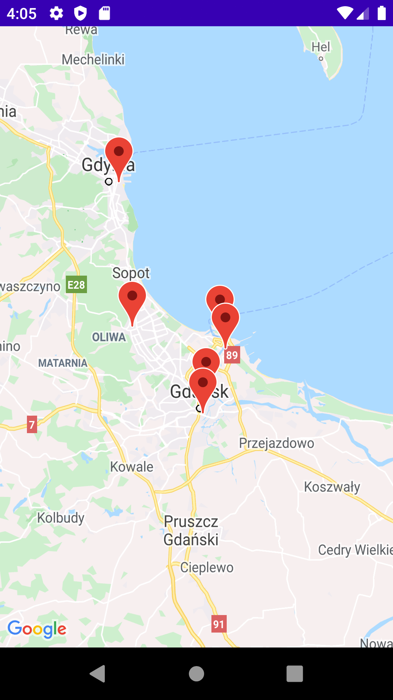
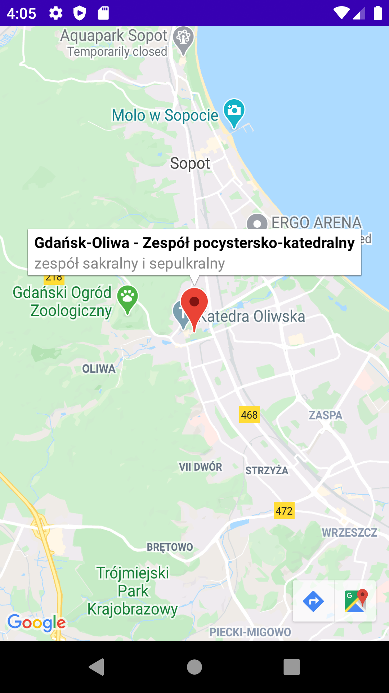
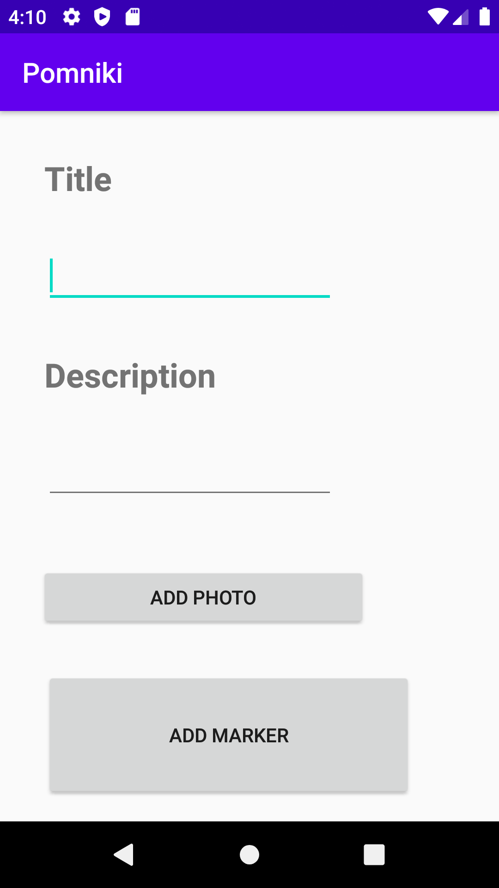

# Pomniki

Location of historical monuments in Poland

### About

Pomniki is native Android application. Main feature is displaying on map location of historical monuments provided by dane.gov.pl -
Poland's Open Data Portal. App also allows users to create custom markers - long press on map and you will be able to provide title, description and picture. 
Custom markers are stored in Firebase Storage, thanks to that every user will see them on map.

#### Stack
- Android studio
- Java
- Firebase Storage
- Google Maps API

  
  

  
  

